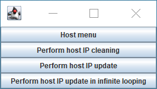
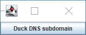
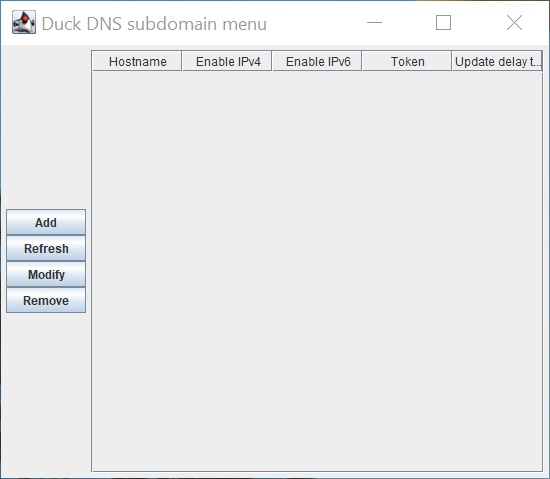
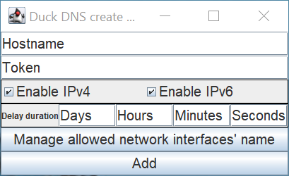
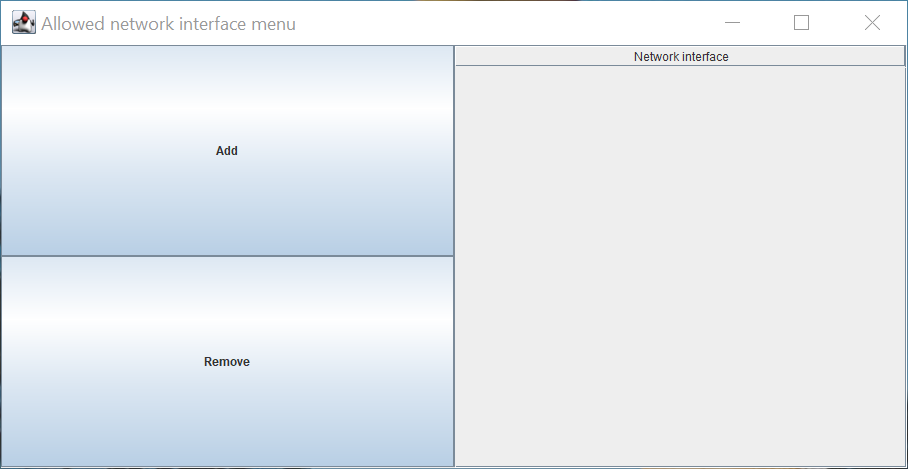
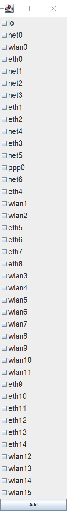
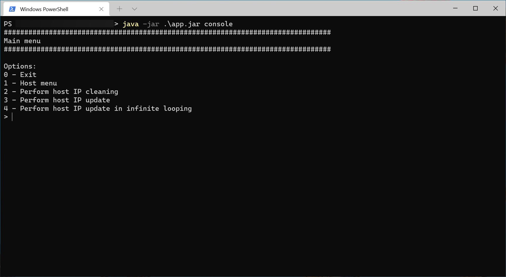
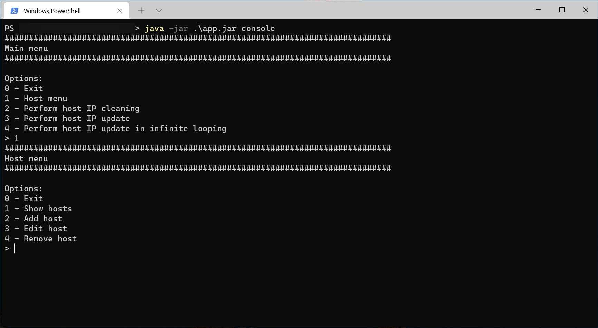
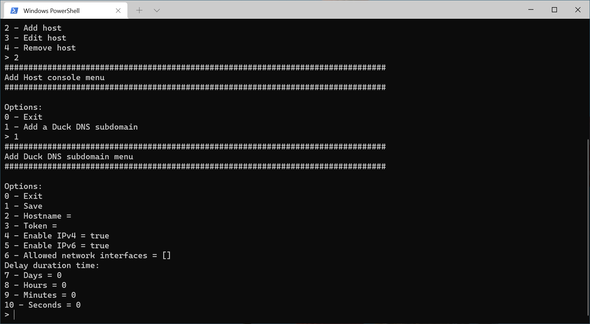
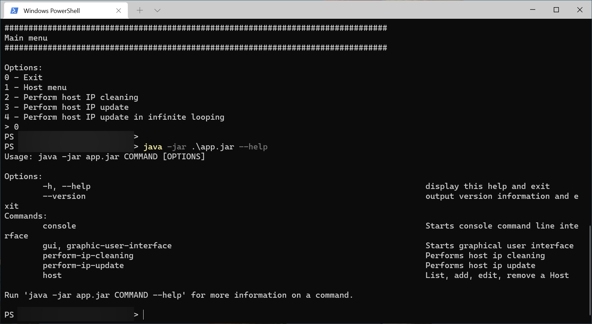

[English version](README.md)

# Dynamic DNS Update Client

Este programa automaticamente atualiza o endereço IP de hosts (domínios e subdomínios) DNS dinâmico.

Foi escrito em Kotlin para Java Virtual Machine.

## Imagens

### Interface Gráfica

*Menu principal*

 *Menu dos hosts*

 *Menu dos subdomínios Duck DNS*

 *Adicionar um host do Duck DNS*

 *Gerenciar interfaces de rede permitidas*

 *Adicionar uma interface de rede*

### Console

 *Menu principal do console*

 *Menu dos hosts no console*

 *Adicionar um host Duck DNS*

### Argumentos de linha de comando

 *Menu de ajuda dos argumentos de linha de comando*

## Instalação / Desinstalação

[Como instalar / desinstalar](installation).

## Serviços de DNS dinâmico compatíveis

Atualmente, o único serviço de DNS dinâmico suportado é o [Duck DNS](https://www.duckdns.org).

## Licença

Este programa está licenciado sobre a licença [European Union Public License 1.2](LICENSE).