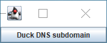
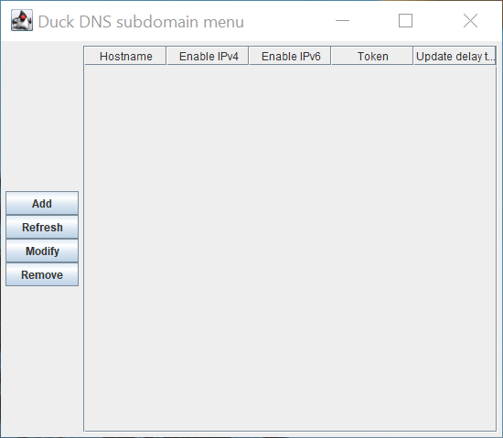
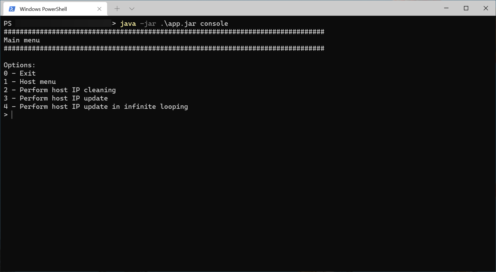
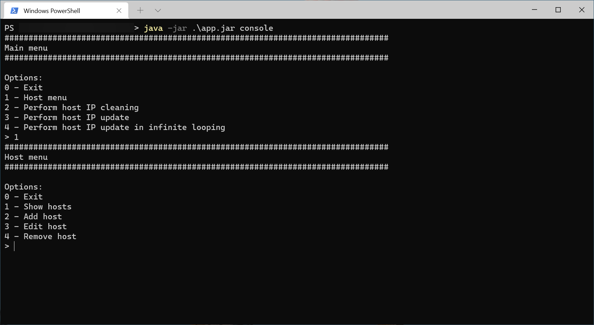
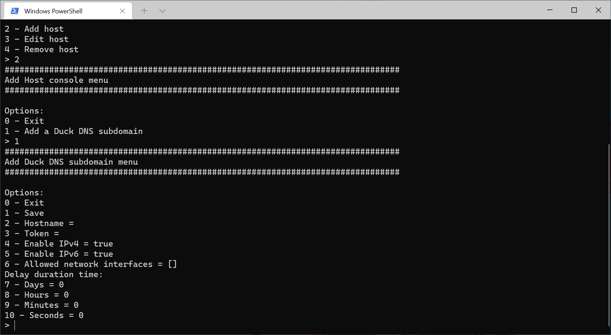
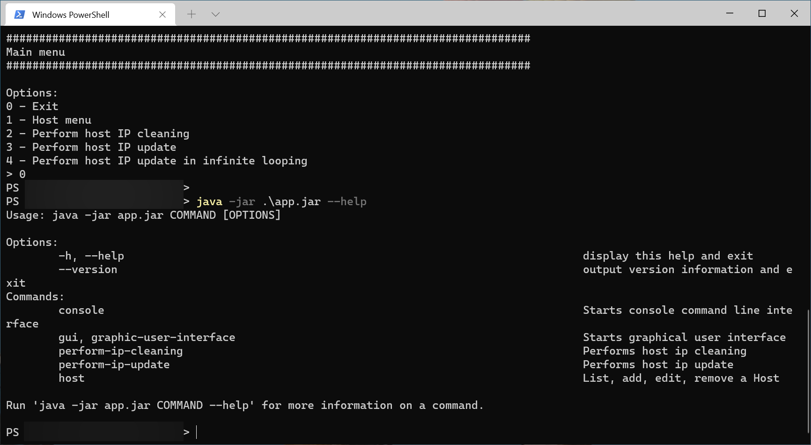

[Versão em Português](README.PT.md)

# Dynamic DNS Update Client

This program automatically updates the IP addresses of Dynamic DNS Hosts.

It was written in Kotlin for Java Virtual Machine.

## Pictures

### Graphical user interface

*Main menu*

 *Host menu*

 *Duck DNS subdomain menu*

 *Add a Duck DNS Host*

 *Manage allowed network interfaces*

 *Add a network interface*

### Console

 *Console main menu*

 *Console host menu*

 *Add a Duck DNS Host*

### Command line program args

 *Command line argument help menu*

## Installation / Uninstall

[How to install / uninstall](installation). 

## Dynamic DNS services compatible

Currently, the only Dynamic DNS service supported is [Duck DNS](https://www.duckdns.org).

## License

This program is licensed under [European Union Public License 1.2](LICENSE).